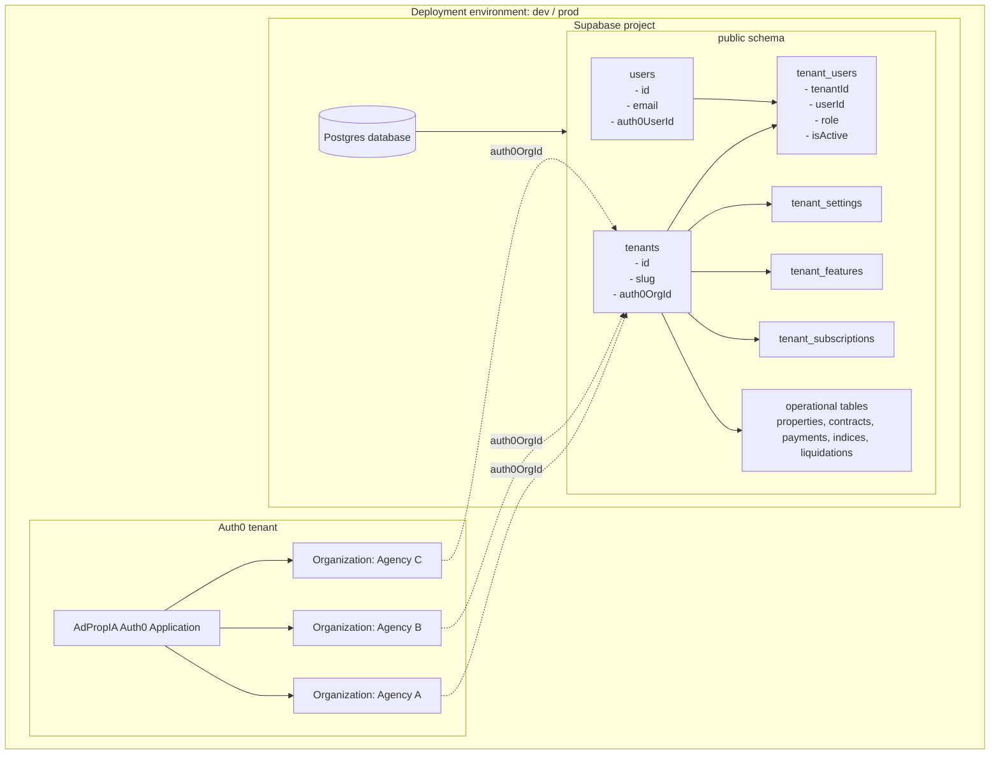
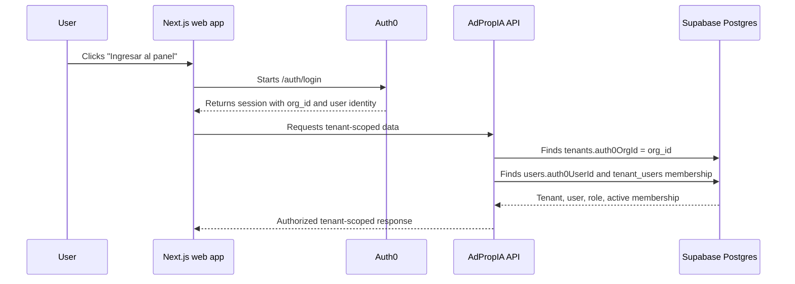

# AdPropIA Multitenancy Architecture

AdPropIA uses one identity environment and one database environment per deployment stage. Business customers are modeled as Auth0 Organizations and as rows in the application `tenants` table, not as separate Auth0 tenants or separate Supabase databases.

## Decision

For the MVP, use this model:

| Layer | Unit per environment | Unit per customer |
|-------|----------------------|-------------------|
| Auth0 | One Auth0 tenant | One Auth0 Organization |
| Supabase | One Supabase project / Postgres database | One `tenants` row |
| Application data | Shared schema with tenant scoping | Rows scoped by `tenantId` |

Do not create a separate Supabase project, Postgres database, or Auth0 tenant for each real-estate agency unless a future enterprise/legal isolation requirement justifies it.

## Architecture diagram



## Request flow



## Data ownership rules

- `tenants.auth0OrgId` maps an Auth0 Organization to one customer tenant in the product.
- `users.auth0UserId` maps an Auth0 user identity to one application user.
- `tenant_users` is the membership and authorization join table.
- `tenant_users.role` is the application source of truth for authorization.
- Operational rows must stay scoped by `tenantId`.

## Why not one database per customer?

One database per customer sounds isolated, but it increases operational cost too early:

- migrations must run across many databases,
- Prisma and connection management become more complex,
- cross-tenant reporting and support workflows become harder,
- backups, restores, and observability multiply,
- the MVP does not need physical data isolation per customer.

Use separate Supabase projects/databases for deployment environments first:

```text
adpropia-dev  -> development and smoke organizations
adpropia-prod -> production organizations
```

Only consider a dedicated database or project for a customer when a future enterprise contract requires physical isolation, custom compliance boundaries, or independent backup/restore policies.

## MVP provisioning model

1. Create or receive an Auth0 Organization for the agency.
2. Create one `tenants` row with `auth0OrgId` pointing to that organization.
3. Create or link `users.auth0UserId` for each user.
4. Create `tenant_users` memberships with application roles.
5. Store customer-specific settings, feature flags, and subscription limits in tenant-scoped tables.

This keeps Auth0 responsible for identity and organization login, while AdPropIA keeps product authorization, tenant data, roles, and business rules inside the application database.
